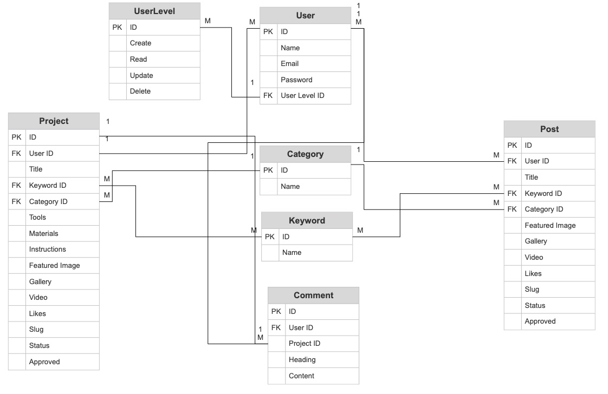

# **Adventures With Wood**

Adventures With Wood is a full stack web application that gives users a platform to view, create and share projects in wood. The intention of the site is to provide a simple, intuitive, visually appealing and user friendly platform for users to share wood-inspired projects and interact with the community. The intended target audience is anyone with an interest in wood, DIY and making things. The target audience will mostly span across men and women from young adults to older generations. 

The application impliments user authorisation and full CRUD functionality, allowing users to create, update, read and delete projects stored in a relational database management system. Users can also like projects to save them to their favourites list and interact with other users via project comments. 

The site also features a back end admin dashboard that allows an administrator to review and approve user comments, as well as monitor and edit projects, posts and users. 

Link to the live site - 

# Contents

* [**Project**](<#project>)
    * [Objective](<#objective>)
    * [Site User Goals](<#site-user-goals>)
    * [Site Owner Goals](<#site-owner-goals>)
    * [**Project Management**](<#project-management>)
        * [GitHub Project Board](<#github-project-board>)
        * [Database Schema](<#database-schema>)
* [**User Experience UX**](<#user-experience-ux>)
    * [User Stories](<#user-stories>)
    * [Site Structure](<#site-structure>)
    * [Typography](<#typography>)
* [**Features**](<#features>)
    * [**Existing Features**](<#existing-features>)
        * [**Homepage**](<#homepage>)
            * [Navigation](<#navigation>)
            * [Carousel](<#carousel>)
            * [Intro](<#intro>)
            * [Most Popular projects List](<#most-popular-projects-list>)
        * [**Authorisation**](<#authorisation>)
            * [Sign Up](<#sign-up>)
            * [Sign In](<#sign-in>)
            * [Sign Out](<#sign-out>)
        * [**Project and Post Details**](<#project-and-post-details>)
            * [Project Details](<#project-details>)
            * [Post Details](<#post-details>)
            * [Like Unlike Project](<#like-unlike-project>)
            * [Project Comments](<#project-comments>)
            * [Comment Form](<#comment-form>)
            * [Comment Form Validation](<#comment-form-validation>)
            * [Post Comment Notification](<#post-comment-notification>)
        * [**Create A Project**](<#create-a-project>)
            * [Create project Form](<#post-project-form>)
            * [Log In To Create project](<#log-in-to-post-project>)
            * [Create project Notification](<#post-project-notification>)
        * [**Create A Post**](<#create-a-post>)
            * [Create post Form](<#post-project-form>)
            * [Log In To Create post](<#log-in-to-create-post>)
            * [Create post Notification](<#create-project-notification>)
        * [**Update Project or Post**](<#update-project-or-post>)
            * [Update Form](<#update-form>)
            * [Log In To Update](<#log-in-to-update>)
            * [Update Notification](<#update-notification>)
         * [**Delete Project or Post**](<#delete-project-or-post>)
            * [Log In To Delete](<#log-in-to-delete->)
            * [Delete Notification](<#delete-notification>)   
        * [**404 Page**](<#404-page>)
    * [**Future Features**](<#future-features>)
        * [Admin Area](<#admin-area>)
        * [User Profile](<#user-profile>)
        * [User Change Password](<#user-change-password>)
        * [Sign Up Email Confirmation](<#sign-up-email-confirmation>)
        * [project Categories](<#project-categories>)
        * [Search projects](<#search-projects>)
* [**Technologies Used**](<#technologies-used>)
    * [Languages](<#languages>)
    * [Frameworks](<#frameworks>)
    * [Software](<#software>)
    * [Libraries](<#libraries>)
* [**Testing**](<#testing>)
    * [**User Story Tests**](<#user-story-tests>)
    * [**Validator Tests**](<#validator-tests>)
        * [W3C (HTML)](<#w3c-html>)
        * [W3C (CSS)](<#w3c-css>)
        * [PEP8 (Python)](<#pep8-python>)
        * [JSHint (JavaScript)](<#jshint-javascript>)
    * [**Input Validation Tests**](<#input-validation-tests>)
        * [Post project Form Tests](<#post-project-form-tests>)
        * [Edit project Form Tests](<#edit-project-form-tests>)
        * [Comment Form Tests](<#comment-form-tests>)
    * [**Additional Tests**](<#additional-tests>)
        * [Manual Tests](<#manual-tests>)
        * [Automated Tests](<#automated-tests>)
        * [Responsive Tests](<#responsive-tests>)
        * [Browser Tests](<#browser-tests>)
        * [Lighthouse Tests](<#lighthouse-tests>)
        * [Wave Accessibility Tests](<#wave-accessibility-tests>)
    * [**Bugs**](<#bugs>)
        * [Resolved](<#resolved>)
        * [Unresolved](<#unresolved>)
* [**Deployment**](<#deployment>)
    * [**Project Deployment Via Heroku**](<#project-deployment-via-heroku>)
* [**Credits**](<#credits>)
    * [**Content**](<#content>)
    * [**Media**](<#media>)
    * [**Code**](<#code>)
*  [**Acknowledgements**](<#acknowledgements>)

# Project 

## Objective

This project was created as a fourth portfolio project submission for the Full Stack Software Development Higher National Diploma at [Code Institute](https://codeinstitute.net/). Amoungst other assessment criteria, the project had to be built using HTML, CSS, JavaScript, Python and Django and feature full CRUD functionality and user authorisation. The project had to also be planned and designed using agile methodologies. 

[Back to top](<#contents>)

## Site User Goals

- To get inspiration for DIY wooden projects
- To view all projects and posts
- To view details or projects and posts
- To view the most popular projects
- To be able to register/sign up to the site
- To comment on and like projects
- To log in to the site
- To create new Projects and Posts
- To update/edit/delete their projects/posts

[Back to top](<#contents>)

## Site Owner Goals

- Provide a stable and enjoyable user experience that encourages interaction and participation.
- The platform should be accessibile, welcoming and appealing to new users.
- Content should be high quality and well structured.
- Provide fully responsive application with straightforward navigation
- Ensure only authenticated and valid users have access to CRUD functionality

[Back to top](<#contents>)

## Project Management

### Github Project Board

An agile methodology was used to plan and design the Adventures with Wood application. User stories were created on GitHub and added to the board in the TODO section. They then moved across the board into IN PROGRESS when they were being actioned, and then into the DONE section when they were completed. This helped greatly in tracking progress and organising and allocating work.

[Back to top](<#contents>)

### Database Schema

Database schemas were drawn up using [App Diagrams.net](https://app.diagrams.net/). The schemas were used to plan the database models and fields. It also helps to display the relationships between the models and how they interact. Adventures With Wood consists of four custom models and one generic - Project, Post, Category, Comment and User. I did not include Keywords or Userlevels in my final design

See Database Image

[Back to top](<#contents>)

# User Experience UX

## User Stories

In terms of project management, user stories are an integral part of the software development creative process. Adventures With Wood consists of 22 user stories. 

A full list of user stories can be found in the [Adventures With Wood GitHub Project Board](https://github.com/users/culanomeara/projects/1/views/1).

[Back to top](<#contents>)

## Site Structure 

The Adventures With Wood app features a simple and user friendly site structure that users will be quite familiar with. However, some content is hidden / restricted to users who are not logged in. The main pages / templates of Adventures With Wood include - the home page, projects lists, posts lists, project details, post details, update project, update post, delete project/post page templates. Site users can freely and easily browse the various pages using the site navigation bar which is visible at the top of each page. The nav bar options automatically change depending on whether a user is signed in or not to allow for easy and intuitive site navigation.

See Database Image

[Back to top](<#contents>)

## Typography 

Adventures With Wood uses [Google Fonts](https://fonts.google.com/) for the site typography. The specific fonts are [Antic](https://fonts.google.com/specimen/Antic). Antic is clear but defined with a clear, functional form.

[Back to top](<#contents>)

# Features

## Existing Features

### Homepage

The homepage is the first page of the site that a user will see when they navigate to the [Adventures With Wood URL](https://adventures.herokuapp.com/). It's designed to be eye catching to users and to quickly summarise the intention of the site. It is also a central location for all users to view projects. 

[Back to top](<#contents>)

#### Navigation

Site navigation is present at all times on every page of the site in the form of header nav bars. These navigational elements change depending on whether a user is logged in or not. Non logged in users only have viewing access to projects and posts. They are unable to comment or like a project. These elements are also fully responsive and the header collapses to become a mobile menu on small screen sizes.

See Database Image

[Back to top](<#contents>)

#### Carousel

The homepage Carousel section is the large eye catching section which is just beneath the navigation bar. The carousel is only displayed on the homepage. It is used to catch the users attention, and to clearly showcase the general topic of the site. It features a large, colourful full screen image and a centralised text box with the project title.

See Database Image

[Back to top](<#contents>)

#### Intro

The homepage intro section is a brief introductory text paragraph that explains the purpose of the site and how to use it to new users. The section also features a divider above and below to clearly define and separate the sections. These stylised dividers are used frequently throughout the site and help to solidify the theme. A lighter shade of the green theme colour is used as a background colour.

[Back to top](<#contents>)

#### Most Popular projects List

The most popular projects feature is another method used to draw in the site visitor and get engagement with the site. This area of the homepage is ordered by projects with the most likes. The list highlights the top three projects.

[Back to top](<#contents>)

### Authorisation

#### Sign Up

A user can navigate to the sign up page via the site navigation bars if they are not logged in. The Adventures With Wood sign up page is a built-in template from the [Django Allauth Package](https://django-allauth.readthedocs.io/en/latest/installation.html). Allauth provides the basic functionality for the user authorisation used in Adventures With Wood. However, the basic allauth template have been customised and styled to match the site design. Once a user submits the form correctly they are redirected back to the homepage as a logged in user.

[Back to top](<#contents>)

#### Sign In

A user can navigate to the Sign in page via the site navigation bars if they are not already signed in. The styling of the sign in page is very similar to the rest of the user authorisation pages. The colour scheme and background image are consistent, but the form and page heading are different. Once the sign in form is submitted correctly the user is redirected to the homepage as a logged in user.

[Back to top](<#contents>)

#### Sign Out

A user can navigate to the log out page via the site navigation bars if they are logged in. They are prompted on this page to confirm if wish to log out. Upon confirmation the user is logged out and redirected to the homepage. The styling and background image is consistent with the other authorisation pages for consistency. 

[Back to top](<#contents>)

### Project and Post Details

#### Project Details
The project details page is a template used to display the full information on a project. Each published project has a details page. Theses pages are available for all users to view, including non logged in users. The main purpose of the page is to display the full project tools, amterials and instructions. Users will generally navigate to a full project page by clicking the view project button on the project card either on the home page or the projects page. As the user has now shown a specific interest in the project, all the information about the project is displayed here.

[Back to top](<#contents>)

#### Post Details
The post details page is a template used to display the full information on a post. Each published post has a details page. Theses pages are available for all users to view, including non logged in users. The main purpose of the page is to display the full post contents. Users will generally navigate to a full post page by clicking thru from the Posts page. As the user has now shown a specific interest in the post, all the information about the post is displayed here.

[Back to top](<#contents>)

#### Like Unlike Project

A user can like and unlike a project from that projects specific project page. Each project features a heart icon at the bottom of the project that can be clicked to like it. It can also be clicked again to unlike a project. When a project is liked by a user, the icon changes to a red heart. Unregistered users cannot like a project. A user who is not logged in only sees how many likes it has. Clicking the icon is disabled for an unregistered user and has no effect. 

[Back to top](<#contents>)

#### Project Comments

At the bottom of each project details page there is a comments section for users to post comments. Logged in users can use the comment form to post a comment to that particular project. Comments are listed from the most recent at the top to the oldest at the bottom. The username of the comment author is displayed as well as the date and the body of the comment. 

[Back to top](<#contents>)

#### Comment Form

The project comment form is what the user uses to post a comment on a project. This comment form is only visible to logged in users. The comment form comprises of one text body field for the comment and a submit button. The author is assigned automatically as well as the "created on" date. 

[Back to top](<#contents>)

#### Comment Form Validation

Javascript is used to validate the comment form. The form is checked for empty space as well as whitespace. Javascript provents the form from being submitted until the comment field passes the test. If the test fails, a pop-up notification appears on the users screen to advise them about the failure. The user can then rectify their mistake and submit the form again. When the comment form is filled out correctly the form submits successfully and the page is refreshed.

[Back to top](<#contents>)

#### Post Comment Notification

Upon the successful submission of the comment form, the page will refresh and a notification will appear at the top of the page. This notification advises the user that their comment has been successfully posted. The notification can be removed from view by clicking the x icon. 

[Back to top](<#contents>)

### Create a new project or post

#### Create a project

The Create template is a page which features a project form to enable users to submit a project to the Adventures With Wood site. This page is only visible to logged in users and appears in the navigation menu. The page features similar styling to the rest of the site for consistency.

[Back to top](<#contents>)

#### Create a post

The Create template is a page which features a post form to enable users to submit a post to the Adventures With Wood site. This page is only visible to logged in users and appears in the navigation menu. The page features similar styling to the rest of the site for consistency.

[Back to top](<#contents>)

#### Create project or post notification

When a user submits a project/post successfully, a message apears confirming the submission of the project/post.

[Back to top](<#contents>)

### Update project or post

The edit project/post page is available to logged in users. The edit button appears at the bottom of the card on the list page or beside the author on the details page. Each of these projects will feature an edit button. When the edit project button is clicked the user is navigated to the edit project page. The page stying and content is exactly the same as the create page, including the project form. The only difference is the form is pre filled out with the content. The user can then use this form to edit the content and submit the amendments to overwrite the previous content.

[Back to top](<#contents>)

#### Log In To Update

?

[Back to top](<#contents>)

#### Update Notification

If a user successfully submits the update form the page is refreshed. A message is displayed to the user which confirms the successful form submission. The user is redirected to the list page for projects/posts.

[Back to top](<#contents>)

### Delete project or post

A user can delete their project or post easily from the relevannt list page or details page. This option is only visible to the author of the project or post. If a user clicks the delete button, a delete confirmation is displayed seeking confirmation from the user for deletion. The user has the option to cancel the delete by clicking the cancel button or to confirm deletion by clicking the delete button. If the user clicks the cancel button the user is reverted back to the previous page. If the user clicks the delete button the project/post is deleted from the database and the page is refreshed showing it removed from the list.

[Back to top](<#contents>)

#### Log In To Delete project

During the process of creating the edit project page it occurred to me that some site users might try to edit projects by manually entering the URL of the project into their browser URL bar. To defend against this I created a notification that hides the project form and displays a notification to the user if they visit the edit project page but they are not logged in. This notification prompts the user to sign up or log in to edit a project. It also provides them with a link to the home page to navigate away from the edit page. 

[Back to top](<#contents>)

#### Delete Notification

If a user confirms the deletion of a project a notification is displayed to the user at the top of the page on refresh. This notification confirms the deletion of the project. The user can hide this notification by clicking the x icon. 

[Back to top](<#contents>)

### 404 Page

The 404 page is triggered when a user navigates to a site URL which doesn't exist. This could be because of a number of reasons, including a faulty link or an expired URL. Most users will not see this page, but it is there as a backup for users who encounter these rare errors. The purpose of the 404 page is to notify the user that there has been an error, and the page that they have tried to access cannot be found. The Adventures With Wood 404 page provides a button link to the homepage for the user to easily navigate back home.

[Back to top](<#contents>)

## Future Features

I believe the Adventures With Wood site has a lot of potential for expansion in the future. The basic functionality is there for the MVP but there are many features I would like to add in the future.

### Admin Area

I was advised by my mentor to add an admin area for administrators so they wouldn't have to log into the Django admin area. I would have liked to have implimented this prior to deadline but unfortunately due to time constraints I chose to prioritise other features. The basic concept would be to have an admin navigation option on the main site navigation bar that is only visible to users with admin privilages. Navigating to this page would open a dashboard for administrators to view the basic site stats like number of posts and comments and new users. They would also be able to execute basic tasks and actions like approving comments and adding a featured project. This page would have to be secured and hidden from other site users.

[Back to top](<#contents>)

### User Profile

Another feature that I believe would greatly improve on the site would be a customisable user profile section. In this section logged in / authorised users would be able to edit and update their profile details. They would also be able to add a profile picture / avatar for further profile customisation. This would greatly improve the social element of the app and the overall user experience. This was another feature I wanted to impliment but it was delayed due to other features taking priority. 

[Back to top](<#contents>)

### User Change Password

One of the first new features I will impliment in the future will be a user password change option for users who forget or want to change their password. Currently a user has no way to retrieve their password / profile if they forget their log in details. This will mean they will lose their access to their profile and projects. This is a big problem and could lead to users abandoning the site in the future. Hence this feature is a priority moving forwards.

[Back to top](<#contents>)

### Sign Up Email Confirmation

Another future feature I would like to impliment relating to authorisation is a user sign up email confirmation. I would like a user sign up to trigger an automated email into the user inbox prompting them to confirm their email address. This would help to prevent spam profiles. Users who sign up but don't confirm their email can still view the site but have limited access to site functionality such as posting and commenting.

[Back to top](<#contents>)

### project Categories

The Adventures With Wood site currently features project category fields which don't have any usable functionality. These fields were originally intended to group projects together to be displayed in project category lists / sections. This is definitely a feature I would like to integrate in the future. I would also like for a user to be able to search the site for a food category and be presented with projects that match that category.

[Back to top](<#contents>)

### Search projects

I did plan to have a search bar on the homepage in the original Adventures With Wood wireframe designs. Unfortunately this feature was delayed due to being a low priority in comparison to other features. In the future I would like a user to be able to use the search bar field on the homepage or the all projects page to search for specific projects / categories. Submitting this field would then return a search template page with a list of any matching results. This would be a better experience for the user rather than having to manually search for a particular project.

[Back to top](<#contents>)

# Technologies Used

## Languages

* [HTML5](https://developer.mozilla.org/en-US/docs/Web/HTML) - Provides the basic content and structure for the site.
* [CSS3](https://developer.mozilla.org/en-US/docs/Web/CSS) - Provides the styling for the site.
* [Python](https://www.python.org/) - Provides the functionality for the site.
* [JavaScript](https://www.javascript.com/) - Provides the interactivity and front end functionality for the site.
* [Git](https://git-scm.com/) - Provides the version control system for the site.

[Back to top](<#contents>)

## Frameworks

* [Tailwind](https://tailwindcss.com/) - A front end CSS utility framework for rapidly building websites.
* [Django](https://www.djangoproject.com/) - A high level Python web framework.

[Back to top](<#contents>)

## Software

* [Balsamiq](https://balsamiq.com/) - An online cloud based software used for creating the site wireframes.
* [GitHub](https://github.com/) - An internet hosting service used for version control. Used to host the Adventures With Wood repository and for the project board used for project management and user stories.
* [GitPod](https://www.gitpod.io/) - A cloud development environment used as the primary site code editor.
* [Heroku](https://dashboard.heroku.com/) - A cloud platform used to host the Adventures With Wood full stack application.
* [Cloudinary](https://cloudinary.com/?&utm_campaign=1329&utm_content=instapagelogocta-selfservetest) - A cloud based video and image management platform used to store the site images.
* [Slack](https://slack.com/intl/en-gb/) - An online instant messaging program used for site feedback and guidance from the [Code Institute](https://codeinstitute.net/) community.
* [Skype](https://www.skype.com/en/) - An online telecommunications application used for mentor sessions.
* [App Diagrams](https://app.diagrams.net/) - An online diagram software used for the database schemas.
* [Google Chrome Dev Tools](https://developer.chrome.com/docs/devtools/) - A set of web developer tools built directly into the chrome browser. Used for responsiveness tests and further testing.
* [Google Fonts](https://fonts.google.com/) - A web based font service by Google used to supply the site typography.
* [Lighthouse](https://developer.chrome.com/docs/lighthouse/overview/) - An open source automated testing tool used for site tests.
* [Responsive Design Checker](https://responsivedesignchecker.com/) - An online testing tool used for responsive site testing.
* [Am I Responsive](https://ui.dev/amiresponsive) - An online testing tool used for responsive site testing.
* [Wave Web Accessibility Evaluation Tool](https://wave.webaim.org/) - An online suite of evaluation tools use to test the site for accessibility.

[Back to top](<#contents>)

## Libraries

This is a list of the Python / Django libraries used in this project.

* [asgiref](https://github.com/django/asgiref) - A standard Python library to allow for asynchronous web apps and servers to communicate with each other. 
* [binaryornot](https://pypi.org/project/binaryornot/) - An ultra lightweight Python package to guess whether a file is binary or text.
* [chardet](https://pypi.org/project/chardet/) - A universal encoding detector for Python3.
* [click](https://click.palletsprojects.com/en/8.1.x/) - A Python package for creating beautiful command line interfaces in a composable way with as little code as possible.
* [cloudinary](https://pypi.org/project/cloudinary/) - A Python package allowing integration between the application and Cloudinary. 
* [cookiecutter](https://cookiecutter.readthedocs.io/en/stable/) - A Python package used to create projects from project templates.
* [dj-database-url](https://pypi.org/project/dj-database-url/) - A Django utility to utilise the DATABASE_URL environment variable to configure the Django application. Used with PostgreSQL.
* [dj3-cloudinary-storage](https://pypi.org/project/dj3-cloudinary-storage/) - A Django package that facilitates integration with Cloudinary storage.
* [Django](https://www.djangoproject.com/) - A python package for the Django framework.
* [django-active-link](https://pypi.org/project/django-active-link/) - A Django package used to highlight an active link in the site navigation bars.
* [django-allauth](https://django-allauth.readthedocs.io/en/latest/) - An integrated set of Django applications addressing user authentication, registration and account management.
* [django-browser-reload](https://github.com/adamchainz/django-browser-reload) - A Django package to automatically refresh the browser during development.
* [django-crispy-forms](https://django-crispy-forms.readthedocs.io/en/latest/) - A Django package that provides tags and filters to control the rendering behaviour of Django forms.
* [django-summernote](https://pypi.org/project/django-summernote/) - A Django package to allow for the embedding of the summernote text editor into Django.
* [django-tailwind](https://django-tailwind.readthedocs.io/en/latest/installation.html) - A Django package to allow for the easy integration of the Tailwind CSS utility framework with Django.
* [gunicorn](https://gunicorn.org/) - A Python WSGI HTTP Server for UNIX.
* [jinja2-time](https://pypi.org/project/jinja2-time/) - A Jinja2 Python extension for dates and times.
* [oauthlib](https://github.com/oauthlib/oauthlib) - A generic, spec-compliant, thorough implementation of the OAuth request-signing logic for Python 3.6+.
* [psycopg2](https://pypi.org/project/psycopg2/) - A PostgreSQL database adapter for Python.
* [PyJWT](https://pyjwt.readthedocs.io/en/latest/) - A Python library that allows for encoding and decoding of JSON Web Tokens (JWT).
* [python-slugify](https://pypi.org/project/python-slugify/) - A Python application that generates slug fields from unicode strings.
* [python3-openid](https://pypi.org/project/python3-openid/) - A set of Python packages to support use of the OpenID decentralized identity system.
* [pytz](https://pypi.org/project/pytz/) - A Python package for world timezone definitions, modern and historical.
* [requests-oauthlib](https://pypi.org/project/requests-oauthlib/) - A Python package for OAuthlib authentication support for Requests.
* [sqlparse](https://pypi.org/project/sqlparse/) - A non-validating SQL parser for Python.
* [text-unidecode](https://pypi.org/project/text-unidecode/) - The most basic Text::Unidecode port for Python.

[Back to top](<#contents>)

# Testing

The Adventures With Wood site has been tested rigorously throughout the development process. This section will document those testing proceedures.

## User Story Tests

1. As a **user** I can **view a list of projects I have liked** so that **I can easily review my favourites**

### Acceptance Criteria:
* Acceptance Criteria 1: A 'my favourites' link should appear in the site nav for a logged in user
* Acceptance Criteria 2: The link should open the 'my favourites' page which displays a list of all the current users liked projects
* Acceptance Criteria 3: Each project should provide a link to the full project page

### Tasks:
- [x] Add MyFavourites class view with logic into views.py
- [x] Add URL path for the MyFavourites view in urls.py
- [x] Create template for my_favourites and add content, logic and styling
- [x] Add template URL link to base template nav menus
- [x] Test functionality

2. As a **user** I can **delete one or more of my projects** so that **I can remove them from the site and from public view**

### Acceptance Criteria:
* Acceptance Criteria 1: When a user is logged in and has saved projects, the 'my projects' page should show a delete button beside all projects
* Acceptance Criteria 2: When clicked by a user, the delete button should open a pop-up window asking the user to confirm their intention to delete their project. They should also be warned that this cannot be undone and the project will be lost. 
* Acceptance Criteria 3: The user should be presented with a go-back button and a confirm deletion button. Clicking the go back button should close the pop-up window and return the user to the original 'my projects' view. 
* Acceptance Criteria 4: Clicking the confirm deletion button should delete the project, remove it from the home page and refresh the 'my projects' page to show that the project is no longer on the list

### Tasks:
- [x] Add a Deleteproject view to views.py with logic 
- [x] Add the Deleteproject view path to urls.py 
- [x] Add the delete_project link url to the my_projects template 
- [x] Test functionality

3. As a **user** I can **view a list of the projects I have posted** so that **I can easily review them and edit them if necessary**

### Acceptance Criteria:
* Acceptance Criteria 1: A link called my projects should appear in the site nav bar 
* Acceptance Criteria 2: The link should only appear to logged in users
* Acceptance Criteria 3: The link should navigate the user to a 'my projects' page which displays the projects the user has posted
* Acceptance Criteria 4: This page should display a message of 'sorry, you have no projects yet' if the user doesn't have any posted projects
* Acceptance Criteria 5: The page should also feature a 'post a project' button which navigates the user to the post a project page form

### Tasks:
- [x] Add Myprojects class view with logic to views.py
- [x] Add URL path for Myprojects class in urls.py
- [x] Create template for my_projects and add logic, content and styling
- [x] Add URL link to my_projects into base template navigation menus
- [x] Test functionality

4. As a **user** I can **edit my current projects** so that **I can add amendments to the project or publish the project if it is a draft**

### Acceptance Criteria:
* Acceptance Criteria 1: When a user is logged in and has saved projects, the 'my projects' page should show an edit button beside all projects
* Acceptance Criteria 2: The edit button should open the edit project page with a pre-populated form for the current project fields
* Acceptance Criteria 3: The user should be able to edit the content of the fields and click the submit button to overwrite the current form fields 
* Acceptance Criteria 4: A 'go back' button should also be displayed on the page to redirect the user back to the 'my projects' page if they wish to cancel the amendments 
* Acceptance Criteria 5: Upon submission the user should be redirected back to the 'my projects' page and a 'project successfully updated' alert should appear at the top of the screen to notify the user of the successful update

### Tasks:
- [x] Add an Editproject view class with logic to views.py 
- [x] Add a URL path for Editproject in urls.py 
- [x] Create edit_project template and add form and content to template
- [x] Add URL link to my_projects template 
- [x] Test functionality

5. As a **user** I can **store my project post as a draft** so that **I can come back another time and add changes before publishing it online**

### Acceptance Criteria:
* Acceptance Criteria 1: The post a project form should feature a tick-box field that a user can tick to save the post as a draft
* Acceptance Criteria 2: On submission, the user should be redirected to the 'my projects' page 
* Acceptance Criteria 3: The project should appear on the 'my projects' page with a 'draft' label showing next to it

### Tasks:
- [x] Add logic to Myprojects class view to include draft projects
- [x] Add status field to projectForm class in forms.py
- [x] Style status field on post_project and edit_project templates
- [x] Add draft tag and logic to my_projects template
- [x] Test functionality

6. As a **user** I can **post a project** so that **it can be shared online with the community**

### Acceptance Criteria:
* Acceptance Criteria 1: A 'post a project' link should appear in the site nav bar
* Acceptance Criteria 2: The 'post a project' link should only appear for logged in users
* Acceptance Criteria 3: The link should open the post a project page with the post a project form
* Acceptance Criteria 4: On submission, the project should be added to the 'my projects' page and available to view on the home page and on the projects full details page. The user should also be redirected to 'my projects' page and a 'project successfully posted' alert should appear at the top of the page to notify the user of the successful posting

### Tasks:
- [x] Add projectForm class to forms.py 
- [x] Add Postproject class view to views.py and link form
- [x] Add URL path for Postproject to urls.py
- [x] Create post_project template with form, logic and content
- [x] Add post_project URL links to base template nav bars
- [x] Test functionality

7. As a **user** I can **like a project** so that **I can view that project in the project list on my 'my favourites' page at a later date**

### Acceptance Criteria:
* Acceptance Criteria 1: A heart icon should appear next to each project on the home page as well as on the individual project details pages
* Acceptance Criteria 2: The heart icon should only function if a user is logged in
* Acceptance Criteria 3: If a user clicks the heart icon when not logged in the icon doesn't change
* Acceptance Criteria 4: If a user clicks the heart icon when logged in the page should refresh and an alert should be displayed to the user that the project has been added to the 'my favourites' page
* Acceptance Criteria 5: When active, the heart icon should change colour to display that the project has been liked

### Tasks:
- [x] Add likes many-to-many field into project model
- [x] Add projectLike view to views.py
- [x] Add URL for projectLike to urls.py
- [x] Add links to projectLike to project_details template
- [x] Test functionality

8. As a **user** I can **unlike a project** so that **I can remove the project list on the 'my favourites' page**

### Acceptance Criteria:
* Acceptance Criteria 1: A user should be able to unlike a project by clicking the heart icon next to the project
* Acceptance Criteria 2: This functionality should only be available to users who are logged in
* Acceptance Criteria 3: When a user clicks the heart icon of a project which is already liked, the current page should be refreshed and an alert should be displayed to the user that the project has been removed from the 'my favourites' page
* Acceptance Criteria 4: The icon should return back to its original colour to signify it is no longer liked
* Acceptance Criteria 5: This functionality should also be available from the 'my favourites' page

### Tasks:
- [x] Add Unlikeproject view with logic to views.py
- [x] Add path for Unlikeproject view in urls.py
- [x] Add links into my_favourites template
- [x] Test functionality

9. As a **user** I can **post a comment on a project** so that **I can interact with the author and community**

### Acceptance Criteria:
* Acceptance Criteria 1: A comment form should appear beneath each project on the individual project details pages
* Acceptance Criteria 2: The comment field should only appear to logged in users
* Acceptance Criteria 3: The comment form should feature a text area input field and a submit button
* Acceptance Criteria 4: Upon submitting the comment the page should refresh and an alert should be displayed to the user with the message 'comment submitted and awaiting approval'
* Acceptance Criteria 5: After admin approval the comment should appear on the project page

### Tasks:
- [x] Add CommentForm class to forms.py
- [x] Add post comment function to projectDetails view
- [x] Add comment form with logic and content to project_details template
- [x] Test functionality

10. As an **administrator** I can **delete a user account** so that **I can remove users that are violating the community standards**

### Acceptance Criteria:
* Acceptance Criteria 1: The administrator should be able to log into the site admin area and view a list of current users
* Acceptance Criteria 2: Each user should feature an 'x' icon or delete button next to their username or email address
* Acceptance Criteria 3: Upon clicking the delete button a pop-up window should open asking for the administrator to confirm their decision to delete the user. The window should display a message warning that the action cannot be undone.
* Acceptance Criteria 4: A cancel button should be available for the administrator to cancel the action and return to the unedited list
* Acceptance Criteria 5: Upon clicking the window delete button the user should be deleted along with all their comments and projects. The admin area should be refreshed showing the updated user list with the deleted user removed

### Tasks:
- [x] Set up allauth with django
- [x] Add users to database
- [x] Test functionality

11. As a **user** I can **log into my account** so that **I can access my projects and interact with the community**

### Acceptance Criteria:
* Acceptance Criteria 1: A login link should appear in the site nav bar
* Acceptance Criteria 2: The link should only appear to users who aren't logged in
* Acceptance Criteria 3: The link should lead to a login page and redirect back to the homepage after the user logs in

### Tasks:
- [x] Install allauth package to django
- [x] Add allauth settings into settings.py
- [x] Copy login allauth template and add content and custom styling
- [x] Add URL to login template to base template navigation menus
- [x] Test functionality

12. As a **user** I can **sign out of my account** so that **I can close the application and navigate away from the page**

### Acceptance Criteria:
* Acceptance Criteria 1: A log out link should appear in the site nav bar
* Acceptance Criteria 2: The link should only appear to users who are logged in 
* Acceptance Criteria 3: When clicked the link should log the user out and redirect them to the home page

### Tasks:
- [x] Implement allauth account_logout functionality
- [x] Add custom styling to logout template
- [x] Add URL link to logout template to base template navigation menus
- [x] Test logout functionality

13. As a **user** I can **register my details** so that **I can create an account and access all the app features**

### Acceptance Criteria:
* Acceptance Criteria 1: A sign up link should appear in the site nav bar
* Acceptance Criteria 2: The link should open the create an account page with a form for a user to enter their email and password
* Acceptance Criteria 3: Upon submission the user should be automatically logged in and redirected to the home page

### Tasks:
- [x] Add python allauth package
- [x] Add allauth settings into settings.py 
- [x] All allauth URL path into urls.py
- [x] Test register functionality
- [x] Copy template files into templates directory and add custom content and styling
- [x] Add register URL links to base template navigation menus

14. As a **user** I can **view at least one image of the project** so that **I can see what the finished project looks like**

### Acceptance Criteria:
* Acceptance Criteria 1: Post a project forms should have a required featured image input field and three optional extra image fields
* Acceptance Criteria 2: The featured image for each project should display on the home page 
* Acceptance Criteria 3: The featured image and any further images should display on the full project page
* Acceptance Criteria 4: Gallery images on the project page should be clickable to display the full-size image

### Tasks:
- [x] Install cloudinary
- [x] Add cloudinary settings into settings.py
- [x] Import cloudinary into models.py
- [x] Add featured image and three gallery image fields to project model using cloudinary fields
- [x] Add image fields to projectForm in forms.py
- [x] Add project image tags to project_details template 
- [x] Add content and styling for project images to project_details template along with logic for a placeholder if an image isn't used
- [x] Test functionality

15. As a **user** I can **see the preparation and approximate cooking times for all projects** so that **I can asses what projects are right for me and plan my cooking time**

### Acceptance Criteria:
* Acceptance Criteria 1: Post a project forms should have required preparation and approximate cooking time number fields 
* Acceptance Criteria 2: Preparation and approximate cooking times should display on the full project page details 
* Acceptance Criteria 3: The cooking and preparation times should display as coloured badges 

### Tasks:
- [x] Add prep_time field and cooking_time field to project model
- [x] Add fields to projectForm in forms.py
- [x] Add project prep time and cooking time tags to project_details template 
- [x] Add content and styling for project prep time and cooking time to project_details template
- [x] Test functionality

16. As a **user** I can **see a difficulty rating for each project** so that **I can quickly tell if a project is too difficult for me**

### Acceptance Criteria:
* Acceptance Criteria 1: Post a project forms should display required select fields for easy, medium, hard or expert
* Acceptance Criteria 2: The difficulty rating should appear on every project as a coloured label
* Acceptance Criteria 3: Difficulty ratings should appear on all projects on the home page as well as the individual project details pages

### Tasks:
- [x] Add difficulty field to project model
- [x] Add custom difficulties choices to field options
- [x] Add difficulty field to projectForm in forms.py
- [x] Add project difficulty tag to project_details template with logic
- [x] Add content and styling for project difficulty to project_details template
- [x] Test functionality

17. As a **user** I can **see the approximate amount of people that the projects can serve** so that **I can easily adjust the ingredient amounts to match the number of people I am cooking for**

### Acceptance Criteria:
* Acceptance Criteria 1: The post a project form should have a required serving number field
* Acceptance Criteria 2: The serving number should appear on the details page for every project
* Acceptance Criteria 3: The serving number should appear in a coloured label 

### Tasks:
- [x] Add serves field to project model
- [x] Add serves field to projectForm in forms.py
- [x] Add project serves tag to project_details template 
- [x] Add content and styling for project serves to project_details template
- [x] Test functionality

18. As a **user** I can **see a list of allergens for the projects** so that **I can avoid any projects that contain certain allergens**

### Acceptance Criteria:
* Acceptance Criteria 1: The post a project form should contain a required tick-box field for allergens
* Acceptance Criteria 2: The allergens for each project should be displayed on the individual project full details pages
* Acceptance Criteria 3: The allergens should all be displayed in an easy to view list format which is clearly displayed

### Tasks:
- [x] Add allergens array field to project model
- [x] Add model method string_of_allergens to return a string of the allergens array field 
- [x] Add custom array field class to allow multiple checkbox inputs
- [x] Add allergens field to projectForm in forms.py
- [x] Add project allergens tag to project_details template 
- [x] Add content and styling for project allergens to project_details template
- [x] Test functionality

19. As a **user** I can **see a summarised list of ingredients for each project** so that **I can quickly and easily read through the ingredients to get an idea of the amounts required**

### Acceptance Criteria:
* Acceptance Criteria 1: Post a project forms should have a required text field for an unordered list of ingredients and amounts with visual instructions on how to format the text
* Acceptance Criteria 2: Full ingredient lists should be displayed on each project's full details page
* Acceptance Criteria 3: The ingredients should be displayed as an unordered list with nicely formatted spacing and margins to make them easy to read

### Tasks:
- [x] Add ingredients field to project model
- [x] Add ingredients field to projectForm in forms.py
- [x] Import summernote to projectForm and add widget to field
- [x] Add project ingredients tag to project_details template 
- [x] Add content and styling for project ingredients to project_details template
- [x] Test functionality

20. As a **user** I can **see a numbered list of steps to follow for the project methods** so that **I can easily follow the instructions one by one**

### Acceptance Criteria:
* Acceptance Criteria 1: Post a project forms should feature a required project method text input field. 
* Acceptance Criteria 2: project methods should be displayed on each projects full details page in a numbered list of steps
* Acceptance Criteria 3: Steps should be easy to read and formatted well with spacing and margins 

### Tasks:
- [x] Add method field to project model
- [x] Add method field to projectForm in forms.py
- [x] Import summernote to projectForm and add widget to field
- [x] Add project method tag to project_details template 
- [x] Add content and styling for project method to project_details template
- [x] Test functionality

21. As a **user** I can **click on a project link on the home page and be directed to a full page for the project** so that **I can see the full project details and find out more information**

### Acceptance Criteria:
* Acceptance Criteria 1: A user should be able to click on any project displayed on the home page and be redirected to that projects full page project details
* Acceptance Criteria 2: The page should feature the projects full details as well as a back button to navigate the user back to the home page

### Tasks:
- [x] Add projectDetails class view with logic to views.py
- [x] Add URL path projectDetails in urls.py 
- [x] Create project_details template with content and logic 
- [x] Add URL links to project_details to each project on the index template, as well as the my_favourites template and all projects that are published on the my_projects template
- [x] Test functionality

22. As a **user** I can **view comments on a project** so that **I can see what members of the community have said about the project**

### Acceptance Criteria:
* Acceptance Criteria 1: Any comments posted by users and approved by admin should appear as an ordered list arranged by date posted
* Acceptance Criteria 2: Comments should appear at the bottom of each projects full details page
* Acceptance Criteria 3: Each comment should display the comment text body, date posted and author

### Tasks:
- [x] Import Comments model into views.py
- [x] Add comments queryset with logic to projectDetails view
- [x] Add comments loop and logic into project_details template
- [x] Test functionality

23. As a **user** I can **view a list of the most popular projects on the home page** so that **I can look at an ordered list of the most popular projects within the community**

### Acceptance Criteria:
* Acceptance Criteria 1: A list of the most liked projects should appear on the home page
* Acceptance Criteria 2: The list should be arranged and ordered by most liked
* Acceptance Criteria 3: The list should display a maximum of six projects

### Tasks:
- [x] Amend projectList class view to add queryset for most liked projects
- [x] Add most popular projects section with loop logic, content and styling to index template
- [x] Test functionality

24. As an **administrator** I can **post a project in the admin area** so that **I can add my own project posts**

### Acceptance Criteria:
* Acceptance Criteria 1: The administrator should be able to log into the admin area and view a list of current projects saved in the database
* Acceptance Criteria 2: There should be an 'add' button which opens a new page with a project form
* Acceptance Criteria 3: The administrator should be able to fill out the form and click the save button to add a project
* Acceptance Criteria 4: The project should appear in the project list in the admin area when the page refreshes 

### Tasks:
- [x] Add admin URLS in urls.py
- [x] Configure settings in settings.py
- [x] Import models to admin.py and add classes for each model
- [x] Test functionality

25. As an **administrator** I can **approve a user comment** so that **it can be posted online**

### Acceptance Criteria:
* Acceptance Criteria 1: All comments should first appear as notifications in the site admin area before going live
* Acceptance Criteria 2: The administrator should be able to log into the admin area and review comments listed in order of date posted
* Acceptance Criteria 3: Each comment should feature an approve button which approves the comment and posts the comment live
* Acceptance Criteria 4: Upon approval the comment should be removed from the admin comment approval list 

### Tasks:
- [x]  Add approve_comments action to commentadmin class in admin.py
- [x] Add approve_coments function to update comment approved field to true
- [x] Test functionality

26. As an **administrator** I can **disapprove a comment** so that **it is deleted and doesn't go live on the site if it violates the community standards**

### Acceptance Criteria:
* Acceptance Criteria 1: All comments should first appear as notifications in the site admin area before going live
* Acceptance Criteria 2: The administrator should be able to log into the admin area and review comments listed in order of date posted
* Acceptance Criteria 3: Each comment should feature a disapprove button which deletes the comment before it is posted 
* Acceptance Criteria 4: Upon disapproval the comment should be deleted and removed from the admin comment approval list

### Tasks:
- [x] Add approve_comments action to commentadmin class in admin.py
- [x] Add approve_coments function to update comment approved field to true 
- [x] Test functionality

27. As a **user** I can **view projects on the home page** so that **I can browse through them and find any that interest me**

### Acceptance Criteria:
* Acceptance Criteria 1: The projects should display as a list on the home page
* Acceptance Criteria 2: The projects should provide a picture and basic summary of the project
* Acceptance Criteria 3: The projects should be styled displayed in an appealing way 

### Tasks:
- [x] Add projectList class view to views.py with logic and queryset for projects
- [x] Add URL path for the projectList view to urls.py
- [x] Create index/homepage template with content, logic and styling
- [x] Create base template with header and footer navigation
- [x] Add links to homepage in base template navigation menus
- [x] Test functionality

28. As a **user** I can **view the featured project on the home page** so that **I can see what the recommended project of the week is**

### Acceptance Criteria:
* Acceptance Criteria 1: A featured project should be available to view at the top of the home page
* Acceptance Criteria 2: The project should include a large picture and summary and look eye-catching

### Tasks:
- [x] Amend projectList class view in views.py to include a queryset for the featured project
- [x] Add featured project tags, logic and styling into the index/homepage template
- [x] Test functionality

29. As a **user** I can **view a list of the latest projects on the home page** so that **I can see if there's anything new that I have missed**

### Acceptance Criteria:
* Acceptance Criteria 1: A list of the latest projects should display on the home page in a separate category section
* Acceptance Criteria 2: The list should be arranged by date posted 
* Acceptance Criteria 3: The list should display a maximum of six projects

### Tasks:
- [x] Add created_on date field to project model in models.py
- [x] Add projectList class view with queryset logic for latest projects
- [x] Add URL path for projectList to urls.py 
- [x] Create template for home page called index 
- [x] Add extends base and block content tags into template
- [x] Add URL links to the index page into the navigation menus in the base template
- [x] Add latest projects section with loop logic, content and styling into the home template
- [x] Test functionality

30. As an **administrator** I can **edit user projects** so that **I can correct grammar or styling issues**

### Acceptance Criteria:
* Acceptance Criteria 1: The administrator should be able to log into the admin area and see a list of all the current projects
* Acceptance Criteria 2: Each project should have an edit button or a pencil icon 
* Acceptance Criteria 3: Upon clicking the edit button or pencil icon the fields for that project post should be displayed with the pre-populated field contents
* Acceptance Criteria 4: Contents on the project fields should be editable, and clicking the submit button after making field changes should alter the project content on the live site on the home page and on the full project details page
* Acceptance Criteria 5: It should be possible to cancel the edit action by clicking a cancel or back button on the edit form to return the administrator back to the list without editing the project content

### Tasks:
- [x] Import models into admin.py
- [x] Add admin classes for each database model
- [x] Test functionality

31. As an **administrator** I can **delete user projects** so that **I can remove them from the site if they do against the community standards**

### Acceptance Criteria:
* Acceptance Criteria 1: The administrator should be able to log into the admin area and see a list of all the current projects
* Acceptance Criteria 2: Each project in the list should have an delete button or an 'x' icon
* Acceptance Criteria 3: Upon clicking the delete button or 'x' icon a pop-up window should display on the screen asking the administrator to confirm their intention to delete the project. The window should contain text content to inform the administrator that the delete action cannot be undone.
* Acceptance Criteria 4: A cancel button should be available on the window to return the administrator to the unedited list if clicked
* Acceptance Criteria 5: Clicking the confirm/delete button should delete the project and remove it from the site completely. The pop-up window should be closed and the window refreshed to show an updated list of projects with the deleted project removed

### Tasks:
- [x] Import models to admin.py
- [x] Add admin classes for each database model
- [x] Test functionality

32. As an **admin** I can **make a project featured** so that **the project can be viewed as the featured project on the home page**

### Acceptance Criteria:
* Acceptance Criteria 1: Admin should be able to log into the admin area and view the list of current projects
* Acceptance Criteria 2: The admin dashboard should feature an action to add/remove featured
* Acceptance Criteria 3: Admin should be able to tick a project and turn the featured field on/off 
* Acceptance Criteria 4: This project should then appear on the index page as a featured project

### Tasks:
- [x] Add featured field to project model in models.py
- [x] Add add_featured and remove_featured actions and methods into the projectAdmin class in admin.py
- [x] Add featured field into projectAdmin list display
- [x] Test functionality

33. As a **user** I can **view all the projects on one page** so that **I can browse all the projects in one list**

### Acceptance Criteria:
* Acceptance Criteria 1: A 'view all projects' button link should appear after each project list on the index page
* Acceptance Criteria 2: When clicked, the link should open the 'all projects' page
* Acceptance Criteria 3: All projects should be displayed as cards in a paginated list 

### Tasks:
- [x] Create Allprojects class view in views.py
- [x] Add the URL path for the Allprojects view in urls.py
- [x] Create the all_projects template with content, styling and logic
- [x] Add URL links from the index template to the all_projects template
- [x] Test functionality

[Back to top](<#contents>)

## Validator Tests

### W3C (HTML)

When the Adventures With Wood site was first tested with the [W3C HTML Markup Validation Service](https://validator.w3.org/) it showed one error and some warnings. The error was a stray unordered list closing tag and the warnings were due to aria labels being used on non interactive icon elements. After I fixed these issues the test showed no errors or warnings.

[Back to top](<#contents>)

### W3C (CSS)

The Adventures With Wood CSS stylesheet has been tested using the [W3C CSS Validation Service](https://jigsaw.w3.org/css-validator/) by direct input. Unfortunately there were some errors shown for the @tailwind selectors at the top of the CSS file. These selectors are for the tailwind utility framework that Adventures With Wood uses for styling. However, with these selectors commented out the CSS test passed with no errors or warnings.

[Back to top](<#contents>)

### PEP8 (PYTHON)

Due to the closure of the PEP8 Python Validation online site, I used the new [Code Institute Python Linter](https://pep8ci.herokuapp.com/) to test all of the Adventures With Wood python code files. 

#### admin.py

#### settings.py

#### forms.py

#### models.py

#### urls.py

#### views.py

[Back to top](<#contents>)

### JSHint (JavaScript)

[Back to top](<#contents>)

## Input Validation Tests

### Post project Form Tests

[Back to top](<#contents>)

### Edit project Form Tests

[Back to top](<#contents>)

### Comment Form Tests

[Back to top](<#contents>)

## Additional Tests

### Manual Tests

[Back to top](<#contents>)

### Automated Tests

[Back to top](<#contents>)

### Responsive Tests

[Back to top](<#contents>)

### Browser Tests

[Back to top](<#contents>)

### Lighthouse Tests

[Back to top](<#contents>)

### Wave Accessibility Tests

[Back to top](<#contents>)

## Bugs

### Resolved 

[Back to top](<#contents>)

### Unresolved

[Back to top](<#contents>)

# Deployment

## Project Deployment via Heroku

This is a guide on how to deploy a project via [Heroku](https://www.heroku.com).

[Back to top](<#contents>)

# Credits

## Content

readme structure adapted from [Matthew Hurrell] https://github.com/Matthew-Hurrell/viva-la-nacho/blob/main/README.md

[Back to top](<#contents>)

## Media

[Back to top](<#contents>)

## Code 

[Back to top](<#contents>)

# Acknowledgements

[Back to top](<#contents>)

