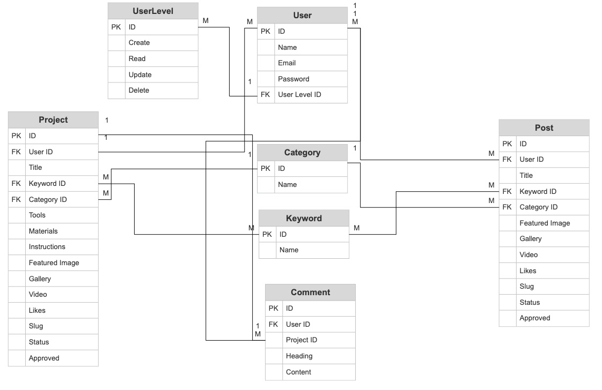
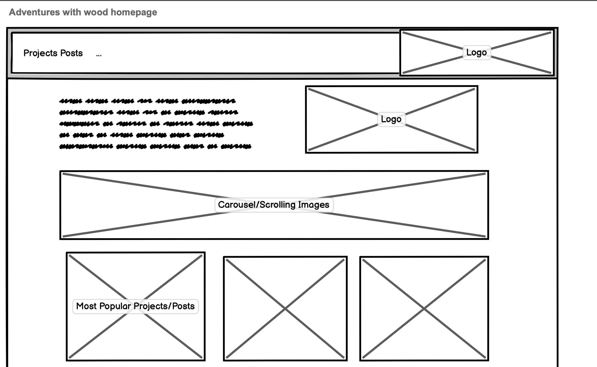
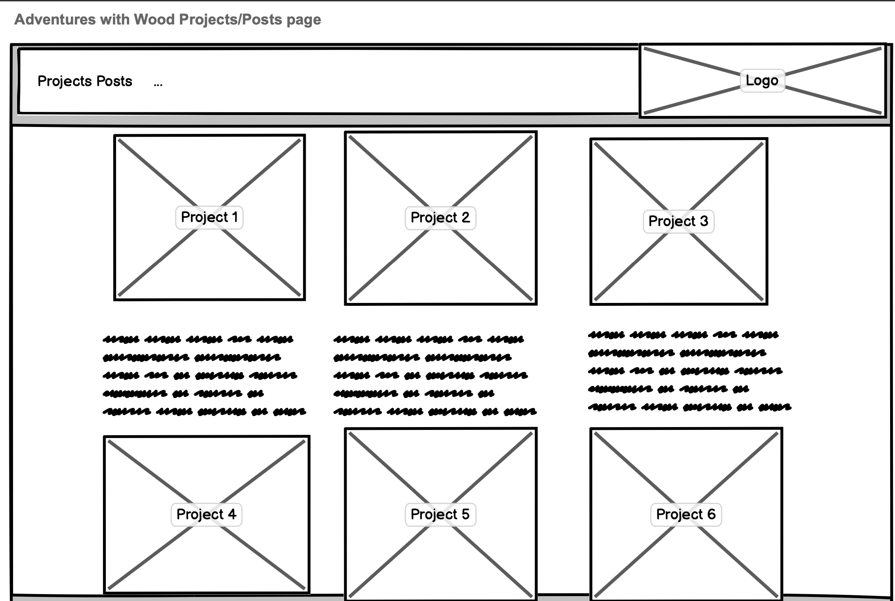
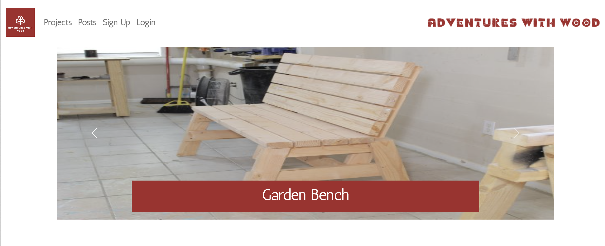
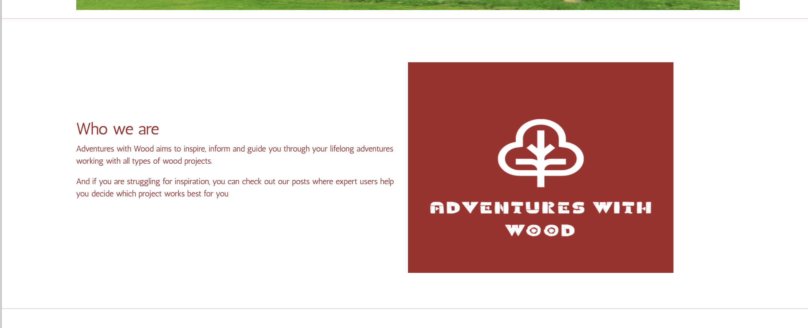
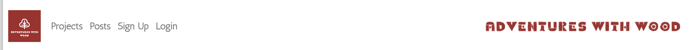
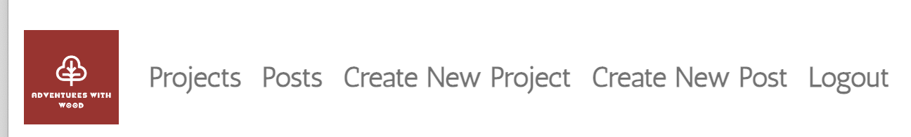
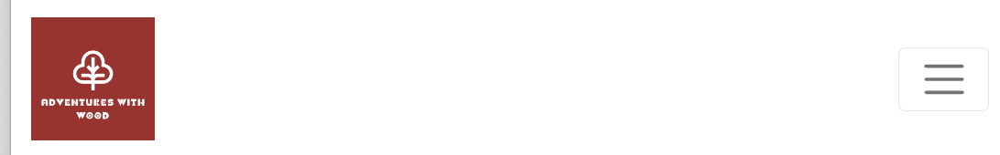

# **Adventures With Wood**

Adventures With Wood is a full stack web application that gives users a platform to view, create and share projects in wood. The intention of the site is to provide a simple, intuitive, visually appealing and user friendly platform for users to share wood-inspired projects and interact with the community. The intended target audience is anyone with an interest in wood, DIY and making things. The target audience will mostly span across men and women from young adults to older generations. 

The application impliments user authorisation and full CRUD functionality, allowing users to create, update, read and delete projects stored in a relational database management system. Users can also like projects and be part of the site community by adding comments to projects. 

The site also features a back end admin dashboard that allows an administrator to review and approve user comments, as well as monitor and edit projects, posts and users. 

Link to the live site - https://adventureswithwood.herokuapp.com/

# Contents

* [**Project**](<#project>)
    * [Objective](<#objective>)
    * [Site User Goals](<#site-user-goals>)
    * [Site Owner Goals](<#site-owner-goals>)
    * [**Project Management**](<#project-management>)
        * [GitHub Project Board](<#github-project-board>)
        * [Database Schema](<#database-schema>)
* [**User Experience UX**](<#user-experience-ux>)
    * [User Stories](<#user-stories>)
    * [Site Design](<#site-design>)
    * [Site Structure](<#site-structure>)
    * [Typography](<#typography>)
* [**Features**](<#features>)
    * [**Existing Features**](<#existing-features>)
        * [**Homepage**](<#homepage>)
            * [Navigation](<#navigation>)
            * [Carousel](<#carousel>)
            * [Intro](<#intro>)
            * [Most Popular projects List](<#most-popular-projects-list>)
        * [**Authorisation**](<#authorisation>)
            * [Sign Up](<#sign-up>)
            * [Sign In](<#sign-in>)
            * [Sign Out](<#sign-out>)
        * [**Project and Post Details**](<#project-and-post-details>)
            * [Project Details](<#project-details>)
            * [Post Details](<#post-details>)
            * [Like Unlike Project](<#like-unlike-project>)
            * [Project Comments](<#project-comments>)
            * [Comment Form](<#comment-form>)
            * [Form Validation](<#form-validation>)
            * [Post Comment Notification](<#post-comment-notification>)
        * [**Create A Project or Post**](<#create-a-project-or-post>)
            * [Create Form](<#create-form>)
            * [Create Notification](<#create-notification>)
        * [**Update Project or Post**](<#update-project-or-post>)
            * [Update Form](<#update-form>)
            * [Update Notification](<#update-notification>)
        * [**Delete Project or Post**](<#delete-project-or-post>)
            * [Delete Notification](<#delete-notification>)   
        * [**403 Page**](<#403-page>)
        * [**Log In To Update or Delete**](<#log-in-to-update-or-delete>)
    * [**Future Features**](<#future-features>)
        * [Admin Area](<#admin-area>)
        * [User Profile](<#user-profile>)
        * [User Change Password](<#user-change-password>)
        * [Subscription feature](<#subscription-feature>)
        * [Categories](<#categories>)
        * [Search feature](<#search-feature>)
        * [Print Project instructions](<#print-project-instructions>)
* [**Technologies Used**](<#technologies-used>)
    * [Languages](<#languages>)
    * [Frameworks](<#frameworks>)
    * [Software](<#software>)
    * [Libraries](<#libraries>)
* [**Testing**](<#testing>)
    * [**User Story Tests**](<#user-story-tests>)
    * [**Validator Tests**](<#validator-tests>)
        * [W3C (HTML)](<#w3c-html>)
        * [W3C (CSS)](<#w3c-css>)
        * [PEP8 (Python)](<#pep8-python>)
    * [**Input Validation Tests**](<#input-validation-tests>)
        * [Post project Form Tests](<#post-project-form-tests>)
        * [Edit project Form Tests](<#edit-project-form-tests>)
        * [Comment Form Tests](<#comment-form-tests>)
    * [**Additional Tests**](<#additional-tests>)
        * [Manual Tests](<#manual-tests>)
        * [Automated Tests](<#automated-tests>)
        * [Responsive Tests](<#responsive-tests>)
        * [Browser Tests](<#browser-tests>)
        * [Lighthouse Tests](<#lighthouse-tests>)
        * [Wave Accessibility Tests](<#wave-accessibility-tests>)
    * [**Bugs**](<#bugs>)
        * [Resolved](<#resolved>)
        * [Unresolved](<#unresolved>)
* [**Setup and Deployment**](<#setup-and-deployment>)
    * [**Setup**](<#setup>)
    * [**Deployment to Heroku**](<#deployment-to-heroku>)
    * [**Final Production Deployment**](<#final-production-deployment>)
    * [**Forking**](<#forking>)
    * [**Cloning**](<#cloning>)
* [**Credits**](<#credits>)
    * [**Content**](<#content>)
    * [**Media**](<#media>)
    * [**Code**](<#code>)
*  [**Acknowledgements**](<#acknowledgements>)

# Project 

## Objective

This project was created for Portfolio Project Four submission for the Full Stack Software Development Higher National Diploma at [Code Institute](https://codeinstitute.net/). Amoungst other assessment criteria, the project had to be built using HTML, CSS, JavaScript, Python and Django and feature full CRUD functionality and user authorisation. The project also had to be planned and designed using Agile methodologies. 

[Back to top](<#contents>)

## Site User Goals

- To get inspiration for DIY wooden projects
- To view all projects and posts
- To view details or projects and posts
- To view the most popular projects
- To be able to register/sign up to the site
- To comment on and like projects
- To log in to the site
- To create new Projects and Posts
- To update/edit/delete their projects/posts

[Back to top](<#contents>)

## Site Owner Goals

- Provide a stable and enjoyable user experience that encourages interaction and participation.
- The platform should be accessibile, welcoming and appealing to new users.
- Content should be high quality and well structured.
- Provide fully responsive application with straightforward navigation
- Ensure only authenticated and valid users have access to CRUD functionality

[Back to top](<#contents>)

## Project Management

### Github Project Board

Agile methodology was used to plan and design the Adventures with Wood application. User stories were created on GitHub and added to the board in the TODO section. They then moved across the board into IN PROGRESS when they were being actioned, and then into the DONE section when they were completed. This helped greatly in tracking progress and organising and allocating work.

[Back to top](<#contents>)

### Database Schema

Database scheme was drawn up using [App Diagrams.net](https://app.diagrams.net/). The scheme was used to plan the database models and fields. It also helped to display the relationships between the models and how they interact. Adventures With Wood consists of four custom models and one generic - Project, Post, Category, Comment and User. I did not include Keywords or Userlevels in my final design

[Back to top](<#contents>)

# User Experience UX

## User Stories

In terms of project management, user stories are an integral part of the software development creative process. Adventures With Wood consists of 22 user stories. 

A full list of user stories can be found in the [Adventures With Wood GitHub Project Board](https://github.com/users/culanomeara/projects/1/views/1).

[Back to top](<#contents>)

## Site Design 

The Adventures With Wood app features a simple and user friendly design. Balsamiq was used to do some wireframe mock ups for the homepage and projects/posts pages.

## Site Structure 

Site structure is one that users will be quite familiar with a top navigation bar. However, some content is hidden / restricted to users who are not logged in. The main pages / templates of Adventures With Wood include - the home page, projects lists, posts lists, project details, post details, update project, update post, delete project/post page templates. Site users can freely and easily browse the various pages using the site navigation bar which is visible at the top of each page. The nav bar options automatically change depending on whether a user is signed in or not to allow for easy and intuitive site navigation.

[Back to top](<#contents>)

## Typography 

Adventures With Wood uses [Google Fonts](https://fonts.google.com/) for the site typography. The specific fonts are [Antic](https://fonts.google.com/specimen/Antic). Antic is clear but defined with a clear, functional form.

[Back to top](<#contents>)

# Features

## Existing Features

### Homepage

The homepage is the first page of the site that a user will see when they navigate to the [Adventures With Wood URL](https://adventureswithwood.herokuapp.com/). It's designed to be eye catching to users and to quickly summarise the intention of the site. It is also a central location for all users to view projects. 

- Nav bar and Carousel

- Who We are

- Most Popular Projects

[Back to top](<#contents>)

#### Navigation

Site navigation is present at all times on every page of the site in the form of header nav bars. These navigational elements change depending on whether a user is logged in or not. Non logged in users only have viewing access to projects and posts. They are unable to comment or like a project. These elements are also fully responsive and the header collapses to become a mobile menu on small screen sizes.

- Navigation Bar - Not Logged in - Full

- Navigation Bar - Logged in - Full

- Navigation Bar - Mobile

[Back to top](<#contents>)

#### Carousel

The homepage Carousel section is the large eye catching section which is just beneath the navigation bar. The carousel is only displayed on the homepage. It is used to catch the users attention, and to clearly showcase the general topic of the site. It features a large, colourful full screen image and a centralised text box with the project title. It auto scrolls but users also have the option of clicking left or right using the arrows on the image. If users click on an image they are brought to the Project details page for that project.

- Carousel

[Back to top](<#contents>)

#### Intro

The homepage Introduction section is a brief introductory text paragraph that explains the purpose of the site and 'Who We Are' and how to use it to new users.

- Who We are

[Back to top](<#contents>)

#### Most Popular projects List

The most popular projects feature is another method used to draw in the site visitor and get engagement with the site. This area of the homepage is ordered by projects with the most likes. The list highlights the top three projects.

- Most Popular Projects

[Back to top](<#contents>)

### Authorisation

#### Sign Up

A user can navigate to the sign up page via the site navigation bars if they are not logged in. The Adventures With Wood sign up page is a built-in template from the [Django Allauth Package](https://django-allauth.readthedocs.io/en/latest/installation.html). Allauth provides the basic functionality for the user authorisation used in Adventures With Wood. However, the basic allauth template have been customised and styled to match the site design. Once a user submits the form correctly they are redirected back to the homepage as a logged in user.

[Back to top](<#contents>)

#### Sign In

A user can navigate to the Sign in page via the site navigation bars if they are not already signed in. The styling of the sign in page is very similar to the rest of the user authorisation pages. The colour scheme and layout are consistent, but the form and page heading are different. Once the sign in form is submitted correctly the user is redirected to the homepage as a logged in user.

[Back to top](<#contents>)

#### Sign Out

A user can navigate to the log out page via the site navigation bars if they are logged in. They are prompted on this page to confirm if wish to log out. Upon confirmation the user is logged out and redirected to the homepage. 

[Back to top](<#contents>)

### Project and Post Details

#### Project Details
The project details page is a template used to display the full information on a project. Each published project has a details page. Theses pages are available for all users to view, including non logged in users. The main purpose of the page is to display the project tools, amterials and instructions. Users will generally navigate to a full project page by clicking the view project button on the project card either on the home page or the projects page. As the user has now shown a specific interest in the project, all the information about the project is displayed here.

[Back to top](<#contents>)

#### Post Details
The post details page is a template used to display the full information on a post. Each published post has a details page. Theses pages are available for all users to view, including non logged in users. The main purpose of the page is to display the full post contents. Users will generally navigate to a full post page by clicking thru from the Posts page. As the user has now shown a specific interest in the post, all the information about the post is displayed here.

[Back to top](<#contents>)

#### Like Unlike Project

A user can like and unlike a project from that project's specific project page. Each project features a heart icon at the bottom of the project that can be clicked to like it. It can also be clicked again to unlike a project. When a project is liked by a user, the icon changes to a red heart. Unregistered users cannot like a project. A user who is not logged in only sees how many likes it has. Clicking the icon is disabled for an unregistered user and has no effect. 

[Back to top](<#contents>)

#### Project Comments

At the bottom of each project details page there is a comments section for users to post comments. Logged in users can use the comment form to post a comment to that particular project. Comments are listed from the most recent at the top to the oldest at the bottom. The username of the comment author is displayed as well as the date and the body of the comment. 

[Back to top](<#contents>)

#### Comment Form

The project comment form is what the user uses to post a comment on a project. This comment form is only visible to logged in users. The comment form comprises of one text body field for the comment and a submit button. The author and "created on" date are assigned automatically. 

[Back to top](<#contents>)

#### Form Validation

Javascript is used to validate the comment form. The form is checked for empty space as well as whitespace. Javascript provents the form from being submitted until the comment field passes the test. If the test fails, a pop-up notification appears on the users screen to advise them about the failure. The user can then rectify their mistake and submit the form again. When the comment form is filled out correctly the form submits successfully and the page is refreshed.

[Back to top](<#contents>)

#### Post Comment Notification

Upon the successful submission of the comment form, the page will refresh and a notification will appear at the top of the page. This notification advises the user that their comment has been successfully posted. The notification can be removed from view by clicking the x icon. 

[Back to top](<#contents>)

### Create a new project or post

#### Create form

The Create template form is a page which features a project/post form to enable users to submit a project/post to the Adventures With Wood site. This page is only visible to logged in users and appears in the navigation menu. The page features similar styling to the rest of the site for consistency.

[Back to top](<#contents>)

#### Create notification

When a user submits a project/post successfully, a message apears confirming the submission of the project/post.

[Back to top](<#contents>)

### Update project or post

The edit project/post page is available to logged in users. The edit button appears at the bottom of the card on the list page or beside the author on the details page. Each of these projects will feature an edit button. When the edit project button is clicked the user is navigated to the edit project page. The page stying and content is exactly the same as the create page, including the project form. The only difference is the form is pre filled out with the content. The user can then use this form to edit the content and submit the amendments to overwrite the previous content.

[Back to top](<#contents>)

#### Update Notification

If a user successfully submits the update form the page is refreshed. A message is displayed to the user which confirms the successful form submission. The user is redirected to the list page for projects/posts.

[Back to top](<#contents>)

### Delete project or post

A user can delete their project or post easily from the relevannt list page or details page. This option is only visible to the author of the project or post. If a user clicks the delete button, a delete confirmation is displayed seeking confirmation from the user for deletion. The user has the option to cancel the delete by clicking the cancel button or to confirm deletion by clicking the delete button. If the user clicks the cancel button the user is reverted back to the previous page. If the user clicks the delete button the project/post is deleted from the database and the page is refreshed showing it removed from the list.

[Back to top](<#contents>)

#### Delete Notification

If a user confirms the deletion of a project a notification is displayed to the user at the top of the page on refresh. This notification confirms the deletion of the project. The user can hide this notification by clicking the x icon. 

[Back to top](<#contents>)

### 403 Page

The 403 page is triggered when a user navigates to a site URL which they don't have permission to access. This could be because of a number of reasons, mainly if they are not logged in or not the author of a particular project or post

#### Log In To Update or Delete

Users must be logged in and be the author to update or delete a post/project. Some site users might try to update or delete projects or posts by manually entering the URL into the browser URL bar. If a user tries this, they will be rdirected to the sign in page. If they log in correctly and they are the author then the update/delete page will appear. If not, they will be gvein the 403(permission denied) page.

[Back to top](<#contents>)

## Future Features

I believe the Adventures With Wood site has a lot of potential for expansion in the future. The basic functionality is there for the MVP but there are many features I would like to add in the future.

### Admin Area

I would like to add an admin area for administrators so they wouldn't have to log into the Django admin area. I would have liked to have implimented this prior to deadline but unfortunately due to time constraints I chose to prioritise other features. The basic concept would be to have an admin navigation option on the main site navigation bar that is only visible to users with admin privilages. Navigating to this page would open a dashboard for administrators to view the basic site stats like number of posts and comments and new users. They would also be able to execute basic tasks and actions like approving comments and adding a featured project. This page would have to be secured and hidden from other site users.

[Back to top](<#contents>)

### User Profile

Another feature that I believe would greatly improve on the site would be a customisable user profile section. In this section logged in / authorised users would be able to edit and update their profile details. They would also be able to add a profile picture / avatar for further profile customisation. This would greatly improve the social element of the app and the overall user experience. 

[Back to top](<#contents>)

### User Change Password

I woiuld like to offer password change option for users who forget or want to change their password. Currently a user has no way to retrieve their password / profile if they forget their log in details. This will mean they will lose their access to their profile and projects. This is a big problem and could lead to users abandoning the site in the future.

[Back to top](<#contents>)

### Subscription Feature

Another future feature I would like is a subscritpion option where users can sign up to email notifications when there is activity on the site(new project/post/comment on their work).

[Back to top](<#contents>)

### Categories

The Adventures With Wood site currently features project category fields which don't have any usable functionality. These fields were originally intended to group projects together to be displayed in project category lists / sections. This is definitely a feature I would like to integrate in the future. I would also like for a user to be able to search the site for a food category and be presented with projects that match that category.

[Back to top](<#contents>)

### Search feature

I did plan to have a search bar on the homepage in the original Adventures With Wood plan. Unfortunately this feature was delayed due to being a low priority in comparison to other features. In the future I would like a user to be able to use the search bar field on the nav bar or the all projects page to search for specific projects, posts or keywords. Submitting this field would then return a search template page with a list of any matching results. This would be a better experience for the user rather than having to manually search for a particular project.

[Back to top](<#contents>)

### Print project instructions

I did plan to incldue the ability to print out the project instructions so they could be more useable outdoors etc.

[Back to top](<#contents>)

# Technologies Used

## Languages

* [HTML5](https://developer.mozilla.org/en-US/docs/Web/HTML) - Provides the basic content and structure for the site.
* [CSS3](https://developer.mozilla.org/en-US/docs/Web/CSS) - Provides the styling for the site.
* [Python](https://www.python.org/) - Provides the functionality for the site.
* [JavaScript](https://www.javascript.com/) - Provides the interactivity and front end functionality for the site.
* [Git](https://git-scm.com/) - Provides the version control system for the site.

[Back to top](<#contents>)

## Frameworks

* [Bootstrap](https://getbootstrap.com/) - Bootstrap is a free and open-source CSS framework directed at responsive, mobile-first front-end web development. It contains HTML, CSS and JavaScript-based design templates for typography, forms, buttons, navigation, and other interface components..
* [Django](https://www.djangoproject.com/) - Django is a free and open-source, Python-based web framework that follows the model–template–views architectural pattern.

[Back to top](<#contents>)

## Software

* [GitHub](https://github.com/) - An internet hosting service used for version control. Used to host the Adventures With Wood repository and for the project board used for project management and user stories.
* [GitPod](https://www.gitpod.io/) - A cloud development environment used as the primary site code editor.
* [Heroku](https://dashboard.heroku.com/) - A cloud platform used to host the Adventures With Wood full stack application.
* [Cloudinary](https://cloudinary.com/?&utm_campaign=1329&utm_content=instapagelogocta-selfservetest) - A cloud based video and image management platform used to store the site images.
* [Slack](https://slack.com/intl/en-gb/) - An online instant messaging program used for site feedback and guidance from the [Code Institute](https://codeinstitute.net/) community.
* [App Diagrams](https://app.diagrams.net/) - An online diagram software used for the database schemas.
* [Google Chrome Dev Tools](https://developer.chrome.com/docs/devtools/) - A set of web developer tools built directly into the chrome browser. Used for responsiveness tests and further testing.
* [Google Fonts](https://fonts.google.com/) - A web based font service by Google used to supply the site typography.
* [Lighthouse](https://developer.chrome.com/docs/lighthouse/overview/) - An open source automated testing tool used for site tests.
* [Responsive Design Checker](https://responsivedesignchecker.com/) - An online testing tool used for responsive site testing.
* [Am I Responsive](https://ui.dev/amiresponsive) - An online testing tool used for responsive site testing.
* [Wave Web Accessibility Evaluation Tool](https://wave.webaim.org/) - An online suite of evaluation tools use to test the site for accessibility.

[Back to top](<#contents>)

## Libraries

This is a list of the Python / Django libraries used in this project.

* [asgiref](https://github.com/django/asgiref) - A standard Python library to allow for asynchronous web apps and servers to communicate with each other.
* [cloudinary](https://pypi.org/project/cloudinary/) - A Python package allowing integration between the application and Cloudinary.
* [dj-database-url](https://pypi.org/project/dj-database-url/) - A Django utility to utilise the DATABASE_URL environment variable to configure the Django application. Used with PostgreSQL.
* [dj3-cloudinary-storage](https://pypi.org/project/dj3-cloudinary-storage/) - A Django package that facilitates integration with Cloudinary storage.
* [Django](https://www.djangoproject.com/) - A python package for the Django framework.
* [django-allauth](https://django-allauth.readthedocs.io/en/latest/) - An integrated set of Django applications addressing user authentication, registration and account management.
* [django-crispy-forms](https://django-crispy-forms.readthedocs.io/en/latest/) - A Django package that provides tags and filters to control the rendering behaviour of Django forms.
* [django-summernote](https://pypi.org/project/django-summernote/) - A Django package to allow for the embedding of the summernote text editor into Django.
* [gunicorn](https://gunicorn.org/) - A Python WSGI HTTP Server for UNIX.
* [oauthlib](https://github.com/oauthlib/oauthlib) - A generic, spec-compliant, thorough implementation of the OAuth request-signing logic for Python 3.6+.
* [psycopg2](https://pypi.org/project/psycopg2/) - A PostgreSQL database adapter for Python.
* [PyJWT](https://pyjwt.readthedocs.io/en/latest/) - A Python library that allows for encoding and decoding of JSON Web Tokens (JWT).
* [python3-openid](https://pypi.org/project/python3-openid/) - A set of Python packages to support use of the OpenID decentralized identity system.
* [pytz](https://pypi.org/project/pytz/) - A Python package for world timezone definitions, modern and historical.
* [requests-oauthlib](https://pypi.org/project/requests-oauthlib/) - A Python package for OAuthlib authentication support for Requests.
* [sqlparse](https://pypi.org/project/sqlparse/) - A non-validating SQL parser for Python.

[Back to top](<#contents>)

## Testing

The testing approach is as follows:
1. Manual testing of user stories
2. Automated testing

### Manual testing of user stories

### Users
1. I want to get inspiration for DIY wooden projects

**Step** | **Expected Result** | **Actual Result**
------------ | ------------ | ------------ |
Navigate to https://adventureswithwood.herokuapp.com/ | Home page main body loads with carousel, site description and most popular projects | Works as expected |

Screenshot

2. As a user, I can view all projects

**Step** | **Expected Result** | **Actual Result**
------------ | ------------ | ------------ |
Navigate to https://adventureswithwood.herokuapp.com/projects | All projects should be visible | Works as expected |

Screenshot

3. As a user, I can view all projects 

**Step** | **Expected Result** | **Actual Result**
------------ | ------------ | ------------ |
Navigate to https://adventureswithwood.herokuapp.com/ | Projectss page main body loads with all Projectss displayed | Works as expected |

Screenshot

4. As a site user I want to be able to view the most popular Projects

**Step** | **Expected Result** | **Actual Result**
------------ | ------------ | ------------ |
Navigate to https://adventureswithwood.herokuapp.com/ and scroll to most popular Projects section | Projects with likes appear in three panels on homepage | Works as expected |

Screenshot

5. - As a user, I want to be able to view details of a particular project

**Step** | **Expected Result** | **Actual Result**
------------ | ------------ | ------------ |
Navigate to https://adventureswithwood.herokuapp.com/ and click on project image | User can see projects dispalyed on carousel and click on any pciture to be be brought to details page | Works as expected |
Navigate to https://adventureswithwood.herokuapp.com/projects/ and click on a project to see project details page | User can see projects dispalyed and click on any pciture to be be brought to details page | Works as expected |

Screenshot

6. As a user, I want to be able to view details of a particular post

**Step** | **Expected Result** | **Actual Result**
------------ | ------------ | ------------ |
Navigate to https://adventureswithwood.herokuapp.com/posts/ and click on a post to see post details page | User can see posts dispalyed and click on any pciture to be be brought to details page | Works as expected |

Screenshot

7. As a site user, I can log in to like/unlike projects or make comments

**Step** | **Expected Result** | **Actual Result**
------------ | ------------ | ------------ |
Navigate to https://adventureswithwood.herokuapp.com/accounts/login/ and submit user details | User is logged in | Works as expected |

Screenshot

8. As a site user, I want to be able to create new Projects and Posts

**Step** | **Expected Result** | **Actual Result**
------------ | ------------ | ------------ |
Navigate to https://adventureswithwood.herokuapp.com/accounts/login/ and click log in with Google button | account is created for the user with details from Google account | Works as expected |
Navigate to https://adventureswithwood.herokuapp.com/accounts/login/ and click log in with Facebook button | account is created for the user with details from Facebook account | Works as expected |

Screenshot

10. As a site user, I can view comments on an individual project

**Step** | **Expected Result** | **Actual Result**
------------ | ------------ | ------------ |
Navigate to https://adventureswithwood.herokuapp.com//Projectss/ | Projects page loads | Works as expected |
Click on Projects card for more information | Projects detail page loads with comments section at the bottom of the page | Works as expected |
Logged in users can fill out the comment form and click submit button | Comment is submitted for approval | Works as expected |
Admin user approves comment in admin dashboard | Approved comments are displayed on the Projectss page | Works as expected |

Screenshot

11. As a site user, I can log in to comment on projects

12. As a site user, I want to be aware of logged in status

**Step** | **Expected Result** | **Actual Result**
------------ | ------------ | ------------ |
Navigate to any page and check nav bar | Logged in users see welcome message with personalised username and sign out link | Works as expected |
Navigate to any page and check nav bar | Unauthenticated users see welcome message with register and sign in links | Works as expected |

Screenshot

13. As a site user, I want to be able to update/edit/delete my projects/posts

**Step** | **Expected Result** | **Actual Result**
------------ | ------------ | ------------ |
Navigate to https://adventureswithwood.herokuapp.com/contact | Logged in users see username field of form prepopulated | Works as expected |

Screenshot

### Site admin
14. As a site admin, I can create, read, update and delete any project or post to manage site content

**Step** | **Expected Result** | **Actual Result**
------------ | ------------ | ------------ |
Navigate to https://adventureswithwood.herokuapp.com/admin logged in as superuser | Admin dashboard is displayed | Works as expected |
Click on Project add + button | Project add form is presented to user in backend | Works as expected |
Fill out form with relevant details and click save | New project is added to database | Works as expected |
Navigate to https://adventureswithwood.herokuapp.com/ logged in as user | Create New Project option is displayed on top nav bar | Works as expected |
Click on Create New Project menu option  | Create New Project form is presented to user in frontend | Works as expected |
Fill out form with relevant details and click save | New project is added to database | Works as expected |
Navigate to https://adventureswithwood.herokuapp.com/admin logged in as superuser | Admin dashboard is displayed | Works as expected |
Click on Post add + button | Post add form is presented to user in backend | Works as expected |
Fill out form with relevant details and click save | New post is added to database | Works as expected |
Navigate to https://adventureswithwood.herokuapp.com/ logged in as user | Create post option is displayed on the nav bar| Works as expected |
Click on Create New Post menu option  | Create New Post form is presented to user in frontend | Works as expected |
Fill out form with relevant details and click save | New post is added to database | Works as expected |

Screenshot

15. As a site admin, I can approve or disapprove comments so that I can filter out objectionable comments

**Step** | **Expected Result** | **Actual Result**
------------ | ------------ | ------------ |
Navigate to https://adventureswithwood.herokuapp.com/admin logged in as superuser | Admin dashboard is displayed | Works as expected |
Click on Comments table | A list of all comments is displayed | Works as expected |
Select the commetns for approval from list and approve | Approved comments are displayed on the front end of the website | Works as expected |

Screenshot

16. As a site admin, I can create, read, update and delete categories to organise site content

**Step** | **Expected Result** | **Actual Result**
------------ | ------------ | ------------ |
Navigate to https://adventureswithwood.herokuapp.com/admin logged in as superuser | Admin dashboard is displayed | Works as expected |
Click on Category add + button | Category add form is presented to user in backend | Works as expected |
Fill out form with relevant details and click save | New category is added to database | Works as expected |

Screenshot

17. As a site admin, I can choose which Projectss are featured on the home page

Navigate to https://adventureswithwood.herokuapp.com/admin logged in as superuser | Admin dashboard is displayed | Works as expected |
Choose your Projects from the Projectss table | Projects edit form is presented to user in backend | Works as expected |
Select the featured Projects checkbox and click save | New Projects is appearing on the home page carousel | Works as expected |
Navigate to https://adventureswithwood.herokuapp.com/Projectss logged in as superuser | Add Projects button is displayed above Projects list | Works as expected |
Choose your Projects from the Projectss table | Projects edit form is presented to user in frontend | Works as expected |
Select the featured Projects checkbox and click save | New Projects is appearing on the home page carousel | Works as expected |

Screenshot

18. As a site admin, I want to be able to log into admin dashboard to edit projects/posts/categories/comments

Navigate to https://adventureswithwood.herokuapp.com/admin | Admin sign in form is displayed | Works as expected |
Once logged in Projects, Posts, Categories, Comments tables are available | App tables are displayed | Works as expected |

Screenshot

### Site Owner

21. As a site owner, I want data entry to be validated on sign-up page

22. As a site owner, I want the user to come to a custom 404 error page tha explains in simple language what has gone wrong if they enter a URL that does not exist

**Step** | **Expected Result** | **Actual Result**
------------ | ------------ | ------------ |
Type the wrong page in the www address | Reroute to a customised 404 page | Works as expected |

Screenshot

23. As a site owner, I want user to be able to contact me and provide their feedback

**Step** | **Expected Result** | **Actual Result**
Navigate to the contact page, scroll down to contact form | Form allows user to make contact and provide feedback | Works as expected |

Screenshot

### Automated testing

Automated testing was done using the Django's TestCase module. 

### Performing tests on various devices

The website was tested using Google Chrome Developer Tools Toggle Device Toolbar to simulate viewports of different devices.

The website was tested on the following devices:
- MacBook Pro with macOS 13.2
- MS Surface Pro Windows 10
- Samsung s20 with Android v13

## Validator Tests

### W3C (HTML)

When the Adventures With Wood site was first tested with the [W3C HTML Markup Validation Service](https://validator.w3.org/) it showed two errors and some info messages. The errors were missing alts for images. The info messages were all related to a stray semi-colon.

[Back to top](<#contents>)

### W3C (CSS)

The Adventures With Wood CSS stylesheet has been tested using the [W3C CSS Validation Service](https://jigsaw.w3.org/css-validator/) by direct input. Unfortunately there were two errors shown for grid template areas proj1 and proj2. I removed the offending references and the site passed the test.

[Back to top](<#contents>)

### PEP8 (PYTHON)

Due to the closure of the PEP8 Python Validation online site, I used the new [Code Institute Python Linter](https://pep8ci.herokuapp.com/) to test all of the Adventures With Wood python code files. 

#### urls.py
Passed without error

#### settings.py
Has two max line length errors

#### forms.py
Passed without error

#### models.py
Passed without error

#### admin.py
Passed without error

#### views.py
Passed without error

#### tests.py
Passed without error

[Back to top](<#contents>)

## Input Validation Tests

### Create project Form Tests

[Back to top](<#contents>)

### Edit project Form Tests

[Back to top](<#contents>)

### Comment Form Tests

[Back to top](<#contents>)

## Additional Tests

### Manual Tests

[Back to top](<#contents>)

### Automated Tests

Three automated tests were set up in the file tests.py

[Back to top](<#contents>)

### Responsive Tests

[Back to top](<#contents>)

### Browser Tests

#### Site tested in:

[Back to top](<#contents>)

### Lighthouse Tests

[Back to top](<#contents>)

### Wave Accessibility Tests

[Back to top](<#contents>)

## Bugs

### Resolved 

[Back to top](<#contents>)

### Unresolved

[Back to top](<#contents>)

## Setup and Deployment

### Setup

_In GITHUB:_

 Once the repository has been created using the Code Institute student template....

1. Install Django and supporting libraries. 
    * Django and gunicorn --> pip3 install 'django<4' gunicorn
    * Supporting libraries --> pip3 install dj_database_url psycopg2
    * Cloudinary libraries --> pip3 install dj3-cloudinary-storage

2. Create a requirements file --> pip3 freeze --local > requirements.txt

3. Create your project: in this case for-the-love-of-food

4. Create an app using command --> python3 manage.py startapp APP_NAME

5. Add it to installed apps --> INSTALLED_APPS = [
    …
    'APP_NAME',
]

6. Save file and migrate changes using command --> python3 manage.py migrate

7. Run server to test

8. Commit and push changes to github

[Back to top](<#contents>)

### Deployment to Heroku

1. Create Heroku Account
2. In Heroku dashboard: go to Create new app.
3. Give your app a unique name.
4. Select region --> EUROPE
5. Click create App.
6. Go to Database App/Resources/ Add-ons and search and click 'Heroku Postgres'.
7. Go to the Settings tab, scroll down to Config Vars and select Reveal Config Vars and copy text.

_IN GITPOD..._

8. Create env.py file on top of level directory.
9. Import os library
10. set environment variables --> os.environ["DATABASE_URL"] = "Paste in Heroku DATABASE_URL Link"
11. Add in a secret key --> os.environ["SECRET_KEY"] = "Make up your own randomSecretKey"

_IN HEROKU ..._

12. Add secret Key to config vars --> SECRET_KEY, “randomSecretKey”

_IN GITPOD / IN SETTINGS.PY_

13. Reference env.py file -->
import os
import dj_database_url

if os.path.isfile("env.py"):
   import env

14. Remove the secret key and replace it with the following variable--> SECRET_KEY = os.environ.get('SECRET_KEY')

15. Comment out the DataBases section -->
 DATABASES = {
     'default': {
         'ENGINE': 'django.db.backends.sqlite3',
         'NAME': BASE_DIR / 'db.sqlite3',
     }
 }

 16. Add new database section -->
 DATABASES = {
   'default': dj_database_url.parse(os.environ.get("DATABASE_URL"))
}

17. In the terminal, save files and make migrations --> python3 manage.py migrate

_GETTING STATIC AND MEDIA FILES STORED ON CLOUDINARY..._

18. Create a cloudinary account, and copy the CLOUDINARY_URL from the dashboard.

19. Add url to env.py -->
os.environ["CLOUDINARY_URL"] = "cloudinary://************************"

_BACK IN HEROKU ..._

20. Paste Cloudinary URL to Heroku Config Vars -->
Add to Settings tab in Config Vars e.g. COUDINARY_URL, cloudinary://************************

21. In config vars, add DISABLE_COLLECTSTATIC, 1. This will be rmeoved before final deployment.

_IN GITPOD / SETTINGS.PY_

22. Install Cloudinary libraries -->
INSTALLED_APPS = [
    …,
    'cloudinary_storage',
    'cloudinary',
    …,
]

23. Tell Django to use Cloudinary to store media and static files -->
STATIC_URL = '/static/'

STATICFILES_STORAGE = 'cloudinary_storage.storage.StaticHashedCloudinaryStorage'
STATICFILES_DIRS = [os.path.join(BASE_DIR, 'static')]
STATIC_ROOT = os.path.join(BASE_DIR, 'staticfiles')

MEDIA_URL = '/media/'
DEFAULT_FILE_STORAGE = 'cloudinary_storage.storage.MediaCloudinaryStorage'

23. Link file to templates -->
TEMPLATES_DIR = os.path.join(BASE_DIR, 'templates')

24. Change template directory to templates array -->
TEMPLATES = [
    {
        …,
        'DIRS': [TEMPLATES_DIR],
       …,
            ],
        },
    },
]

25. Add heroku hostname to ALLOWED_HOSTS-->
ALLOWED_HOSTS = ["PROJ_NAME.herokuapp.com", "localhost"]

_IN GITPOD..._

26. Create 3 new folders: media, static and templates

27. Create procfile and add code -->
web: gunicorn PROJ_NAME.wsgi

28. In terminal --> Add, Commit and Push

_IN HEROKU ..._

29. Deploy manually -->  Github as deployment method, on main branch

[Back to top](<#contents>)

### Final Production Deployment

_IN GITPOD / ENV.PY_

1. Set DEVELOPMENT varialbe to 0!
2. Add a few more settings--> X_FRAME_OPTIONS = 'SAMEORIGIN'
    * Without this, the summer note editor would no longer work when we deploy the project. This is due to Cross-Origin Resource Sharing, which tells the browser which resources are permitted to be loaded.
3. Save, add and commit as "deployment commit", and push to github.

_IN HEROKU..._

4. In reveal config vars, remove DISABLE_COLLECTSTATIC environment variable.

5. Go to deploy tab, scroll down to the end and deploy our branch! 

6. Your app has been deployed to heroku!

[Back to top](<#contents>)

### Forking

You can Fork the Repository. This makes a copy of the original repository on our Github account so you can make changes without affecting the original repository.
1. Log into GitHub and locate the GitHub repository you want.
2. Click on the "Fork" button which is located in the top right corner.
3. You will now have a copy of the original repository in your GitHub account.

[Back to top](<#contents>)

### Cloning

1. Log into GitHub and locate the GitHub repository you want.
2. Under the repository name, click "Code" button which will come up with a dropdown menu.
3. Where it says Clone, copy the link below.

[Link to deployed site](https://adventureswithwood.herokuapp.com/)

[Back to top](<#contents>)

# Credits

## Content

All content that was copied from other sites such as Instructables https://www.instructables.com/ has been credited on the relevant page itself on the site.

[Back to top](<#contents>)

## Readme
Readme structure adapted from/inspired by:
- Matthew Hurrell https://github.com/Matthew-Hurrell/viva-la-nacho/blob/main/README.md
- John Constant https://github.com/johnConstant/CI_PP4_Projects_site/blob/main/README.md
- Stephanie Crocker https://github.com/stephaniecrocker91/for-the-love-of-food/blob/main/README.md

[Back to top](<#contents>)

## Media

Images were sourced on Google from various sites including Instructables and Pinterest. Creative commons images were used where possible.

The site logo/placeholder image was created using Canva https://www.canva.com/

[Back to top](<#contents>)

## Code 

I used the "I think therefore I blog" walk through project as a starting point and template. I created a blog like page that presented projects and posts. I added to the base code with custom views, models, html and css.

I watched a good few of Codemy videos for Django blog building https://www.youtube.com/watch?v=m3efqF9abyg

I got the idea for the MOST POPULAR projects in this CI PP4 project by John Constant https://ci-pp4-recipe-site.herokuapp.com/

[Back to top](<#contents>)

## Acknowledgements

[Back to top](<#contents>)

